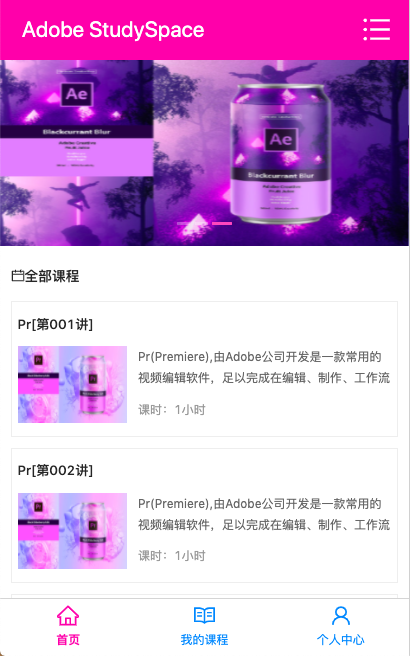
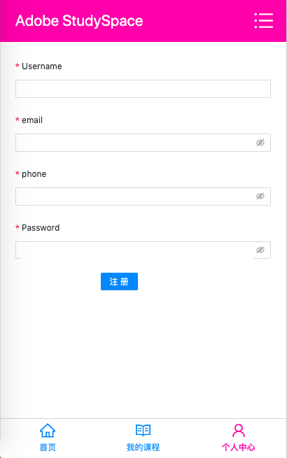
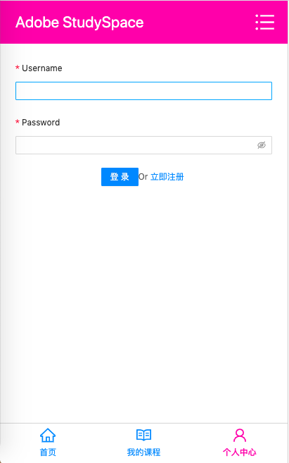
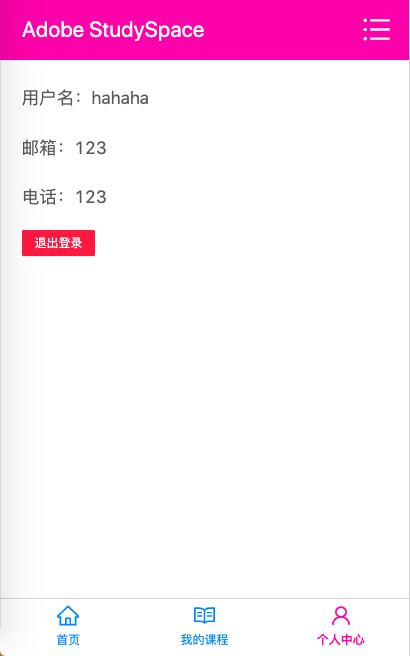

# Adobe Study Space [REACT]
### 技术栈：AntDesign + JavaScript + React + Redux  + Express
```
运行命令：
- 1.cnpm i / npm i
- 2.yarn start 
```
- 首页

- 我的课程

- 已支付课程

- 注册页

- 登录页

- 登录成功

- 课程详情-已加入购物车状态

- 课程详情-未加入购物车状态
